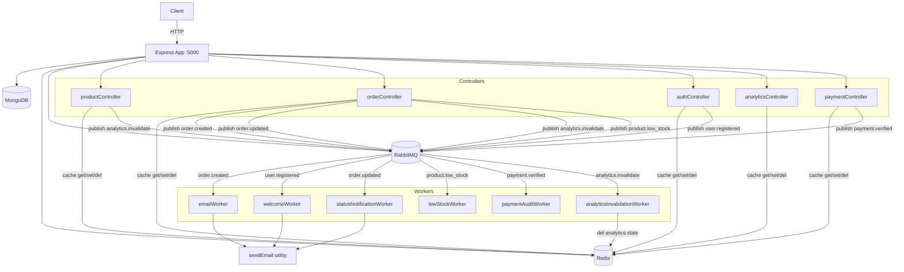

# Design Document: Docker, Redis & RabbitMQ Integration for ShopNest

## Overview

This design adds three infrastructure layers to the existing ShopNest Node.js/Express + MongoDB backend:

1. **Containerisation** — a `docker-compose.yml` at the project root and a `backend/Dockerfile` that bring up `app`, `mongo`, `redis`, and `rabbitmq` as a single stack.
2. **Redis caching** — a thin cache utility wraps every read-heavy controller endpoint; mutations invalidate the relevant keys. A sliding-window rate limiter protects auth endpoints.
3. **RabbitMQ messaging** — controllers publish domain events after successful writes; six lightweight workers consume those events to send emails, log alerts, and invalidate the analytics cache.

All changes are purely additive. Every existing route, model, middleware, and response shape is preserved. When Redis or RabbitMQ is unavailable the application falls back to its pre-integration behaviour transparently.

---

## Architecture



### Startup sequence

```
server.js
  ├── connectDB()          (existing)
  ├── connectRedis()       (new — non-blocking)
  ├── connectRabbitMQ()    (new — non-blocking)
  └── startWorkers()       (new — registers all six consumers)
```

Both `connectRedis` and `connectRabbitMQ` are fire-and-forget: a failure logs a warning but does not prevent the HTTP server from starting.

---

## Components and Interfaces

### `backend/config/redis.js`

```js
// Exports
const redisClient: Redis   // ioredis instance, may be in error state
```

- Reads `REDIS_URL` (default `redis://localhost:6379`).
- Attaches `connect` / `error` event handlers for logging.
- Exports the single client instance.

### `backend/config/rabbitmq.js`

```js
// Exports
async function connectRabbitMQ(): Promise<void>
function getChannel(): amqplib.Channel | null
async function publishMessage(queue: string, payload: object): Promise<void>
```

- Reads `RABBITMQ_URL` (default `amqp://localhost`).
- `connectRabbitMQ` calls `amqplib.connect`, creates a channel, and stores both in module-level variables.
- `getChannel` returns the stored channel or `null` if not connected.
- `publishMessage` asserts the queue as durable, then calls `channel.sendToQueue` with `{ persistent: true }`. If the channel is `null` it logs a warning and returns without throwing.

### `backend/utils/cache.js`

```js
// Exports
async function getCache(key: string): Promise<any | null>
async function setCache(key: string, value: any, ttlSeconds: number): Promise<void>
async function delCache(...keys: string[]): Promise<void>
```

- `getCache` — calls `redisClient.get(key)`, parses JSON, returns `null` on miss or Redis error (logs warning on error).
- `setCache` — calls `redisClient.set(key, JSON.stringify(value), 'EX', ttlSeconds)`. Logs warning on Redis error, does not throw.
- `delCache` — calls `redisClient.del(...keys)`. Logs warning on Redis error, does not throw.

### `backend/middleware/rateLimiter.js`

```js
// Exports
function rateLimiter(req, res, next): void   // Express middleware
```

Sliding-window algorithm using a single Redis key per IP:

1. Key: `ratelimit:{ip}` — value is an integer counter.
2. On each request: `INCR ratelimit:{ip}`.
3. If the result is `1` (first request in window): `EXPIRE ratelimit:{ip} 900`.
4. If count ≥ 10: respond `429 { message: "Too many requests, please try again later." }`.
5. Otherwise: call `next()`.
6. If Redis throws at any point: log warning, call `next()`.

Applied only to `POST /api/auth/login` and `POST /api/auth/register` in `authRoutes.js`.

### Updated Controllers

#### `productController.js`

| Operation | Cache action |
|---|---|
| `getProducts` | Read `products:all` (TTL 300 s); on miss populate and set |
| `getProductById` | Read `products:{id}` (TTL 300 s); on miss populate and set |
| `createProduct` | After save: `del products:all`, `del analytics:stats`, publish `analytics.invalidate` |
| `updateProduct` | After save: `del products:all`, `del products:{id}`, `del analytics:stats`, publish `analytics.invalidate` |
| `deleteProduct` | After delete: `del products:all`, `del products:{id}`, `del analytics:stats`, publish `analytics.invalidate` |

#### `orderController.js`

| Operation | Cache action | Events published |
|---|---|---|
| `addOrderItems` | After save: `del orders:all`, `del orders:user:{userId}`, `del analytics:stats` | `order.created`, `analytics.invalidate`, `product.low_stock` (per out-of-stock item) |
| `getMyOrders` | Read `orders:user:{userId}` (TTL 120 s); on miss populate and set | — |
| `getOrders` | Read `orders:all` (TTL 60 s); on miss populate and set | — |
| `updateOrderStatus` | After save: `del orders:all`, `del orders:user:{order.userId}` | `order.updated`, `analytics.invalidate` |

The existing inline `sendEmail` call in `addOrderItems` is removed; email is sent by `emailWorker`.

#### `authController.js`

| Operation | Cache action | Events published |
|---|---|---|
| `registerUser` | After save: `del users:all` | `user.registered` (with name, email, OTP) |
| `getUsers` | Read `users:all` (TTL 120 s); on miss populate and set | — |

The existing inline `sendEmail` call in `registerUser` is removed; email is sent by `welcomeWorker`.

#### `analyticsController.js`

| Operation | Cache action |
|---|---|
| `getAdminStats` | Read `analytics:stats` (TTL 60 s); on miss run all aggregations and set |

#### `paymentController.js`

| Operation | Cache action | Events published |
|---|---|---|
| `createOrder` | Key `payment:dedup:{userId}:{amountInPaise}` (TTL 600 s); return cached order on hit | — |
| `verifyPayment` | — | `payment.verified` (orderId, paymentId, timestamp) |

### Workers (`backend/workers/`)

Each worker exports a single `start()` function. `server.js` calls all six on startup. If `getChannel()` returns `null`, the worker logs a warning and returns without crashing.

All workers call `channel.assertQueue(queue, { durable: true })` before consuming.

| File | Queue | Action |
|---|---|---|
| `emailWorker.js` | `order.created` | Send order confirmation email via `sendEmail`; ack on success, nack on failure |
| `welcomeWorker.js` | `user.registered` | Send welcome/OTP email via `sendEmail`; ack on success, nack on failure |
| `statusNotificationWorker.js` | `order.updated` | Look up user by `userId`, send status change email; ack on success, nack on failure |
| `lowStockWorker.js` | `product.low_stock` | Log structured warning `{ productId, name, stock }`; ack |
| `paymentAuditWorker.js` | `payment.verified` | Log structured audit entry `{ orderId, paymentId, timestamp }`; ack |
| `analyticsInvalidationWorker.js` | `analytics.invalidate` | `delCache('analytics:stats')`; ack (even if Redis unavailable — log warning) |

### `backend/server.js` changes

```js
// Added after connectDB():
const { connectRedis } = require('./config/redis');
const { connectRabbitMQ } = require('./config/rabbitmq');
const startWorkers = require('./workers');

(async () => {
  await connectRedis();
  await connectRabbitMQ();
  startWorkers();
})();
```

`startWorkers` is a thin `backend/workers/index.js` that calls `start()` on each of the six workers.

---

## Data Models

No existing Mongoose schemas are modified.

### Redis Key Schema

| Key pattern | Owner | TTL | Content |
|---|---|---|---|
| `products:all` | productController | 300 s | JSON array of all Product documents |
| `products:{id}` | productController | 300 s | JSON single Product document |
| `orders:all` | orderController | 60 s | JSON array of all Order documents (userId populated) |
| `orders:user:{userId}` | orderController | 120 s | JSON array of orders for one user |
| `users:all` | authController | 120 s | JSON array of all User documents (password excluded) |
| `analytics:stats` | analyticsController | 60 s | JSON `{ totalOrders, totalProducts, totalUsers, totalRevenue }` |
| `payment:dedup:{userId}:{amountInPaise}` | paymentController | 600 s | JSON Razorpay order object |
| `ratelimit:{ip}` | rateLimiter | 900 s | Integer request counter |

### RabbitMQ Queue Schema

All queues are declared as `durable: true`. All messages are published with `{ persistent: true }`.

| Queue | Publisher | Consumer | Payload |
|---|---|---|---|
| `order.created` | orderController | emailWorker | `{ orderId, email, name, totalAmount, address }` |
| `order.updated` | orderController | statusNotificationWorker | `{ orderId, status, userId }` |
| `user.registered` | authController | welcomeWorker | `{ name, email, otp }` |
| `product.low_stock` | orderController | lowStockWorker | `{ productId, name, stock }` |
| `payment.verified` | paymentController | paymentAuditWorker | `{ razorpay_order_id, razorpay_payment_id, timestamp }` |
| `analytics.invalidate` | orderController, productController | analyticsInvalidationWorker | `{ source }` (e.g. `"order.created"`) |

### Docker Compose Service Definitions

```yaml
services:
  app:
    build: ./backend
    ports: ["5000:5000"]
    env_file: ./backend/.env
    environment:
      REDIS_URL: redis://redis:6379
      RABBITMQ_URL: amqp://rabbitmq
    depends_on:
      mongo:    { condition: service_healthy }
      redis:    { condition: service_healthy }
      rabbitmq: { condition: service_healthy }

  mongo:
    image: mongo:7
    volumes: [mongo_data:/data/db]
    healthcheck: { test: ["CMD","mongosh","--eval","db.adminCommand('ping')"], ... }

  redis:
    image: redis:7-alpine
    volumes: [redis_data:/data]
    healthcheck: { test: ["CMD","redis-cli","ping"], ... }

  rabbitmq:
    image: rabbitmq:3-management
    ports: ["15672:15672"]
    healthcheck: { test: ["CMD","rabbitmq-diagnostics","ping"], ... }

volumes:
  mongo_data:
  redis_data:
```

### Dockerfile (backend)

```dockerfile
FROM node:lts-alpine
WORKDIR /app
COPY package*.json ./
RUN npm ci --omit=dev
COPY . .
EXPOSE 5000
CMD ["node", "server.js"]
```

---

## Correctness Properties

*A property is a characteristic or behavior that should hold true across all valid executions of a system — essentially, a formal statement about what the system should do. Properties serve as the bridge between human-readable specifications and machine-verifiable correctness guarantees.*

### Property 1: Cache read round-trip

*For any* serializable data value stored under a Redis key, calling `getCache` on that key must return a value deeply equal to the original.

**Validates: Requirements 3.1, 3.4, 4.1, 11.1, 12.1, 13.1, 14.1**

### Property 2: Cache miss populates and returns MongoDB data

*For any* controller read endpoint, when the Redis key is absent, the response body must equal the data returned by the MongoDB query, and the key must subsequently exist in Redis with the correct TTL.

**Validates: Requirements 3.2, 4.2, 11.2, 12.2, 13.2, 14.2**

### Property 3: Mutation invalidates all related cache keys

*For any* product or order mutation (create, update, or delete), after the mutation completes, none of the cache keys that reference that resource (e.g. `products:all`, `products:{id}`, `orders:all`, `orders:user:{userId}`, `analytics:stats`) must exist in Redis.

**Validates: Requirements 3.3, 4.3, 11.3, 11.4, 12.3, 13.3, 13.4, 14.3, 14.4**

### Property 4: Redis unavailability never breaks HTTP responses

*For any* request to a cached endpoint, when Redis throws on every operation, the HTTP response must have the same status code and body shape as it would without caching.

**Validates: Requirements 2.2, 3.5, 3.6, 4.4, 10.2**

### Property 5: RabbitMQ unavailability never breaks HTTP responses

*For any* order creation or status update request, when `getChannel()` returns `null`, the HTTP response must be the same status code and body as it would be without RabbitMQ.

**Validates: Requirements 5.2, 6.3, 7.2, 10.3**

### Property 6: Published order.created message contains all required fields

*For any* successfully saved order, the message published to `order.created` must contain `orderId`, `email`, `name`, `totalAmount`, and `address`, each matching the saved order's data.

**Validates: Requirements 6.1, 6.2**

### Property 7: Published user.registered message contains all required fields

*For any* successfully registered user, the message published to `user.registered` must contain `name`, `email`, and a six-digit numeric `otp`.

**Validates: Requirements 17.1, 17.2**

### Property 8: Published order.updated message contains all required fields

*For any* order status update, the message published to `order.updated` must contain `orderId`, `status`, and `userId` matching the updated order.

**Validates: Requirements 7.1**

### Property 9: Low-stock events published for every out-of-stock product

*For any* order containing items where the product's stock reaches 0 or below after the order is saved, a `product.low_stock` message must be published for each such product, containing `productId`, `name`, and `stock`.

**Validates: Requirements 19.1, 19.2, 19.3**

### Property 10: Rate limiter allows requests below threshold and blocks at threshold

*For any* IP address, requests numbered 1 through 9 within a 900-second window must receive the normal controller response, and request number 10 or above must receive HTTP 429 with `{ "message": "Too many requests, please try again later." }`.

**Validates: Requirements 15.1, 15.2, 15.3, 15.4**

### Property 11: Payment deduplication cache prevents duplicate Razorpay calls

*For any* `(userId, amountInPaise)` pair, if a Razorpay order was already created and cached under `payment:dedup:{userId}:{amountInPaise}`, a subsequent identical request must return the cached order object without invoking the Razorpay API again.

**Validates: Requirements 16.1, 16.2, 16.3**

### Property 12: Analytics invalidation worker deletes analytics:stats on every message

*For any* `analytics.invalidate` message received by the worker, after processing, the key `analytics:stats` must not exist in Redis.

**Validates: Requirements 21.6, 21.7**

### Property 13: Email workers send correct content for any message payload

*For any* `order.created` message, the `emailWorker` must call `sendEmail` with the recipient email, a subject containing "Order Confirmation", and a body containing the `orderId` and `totalAmount` from the message. Symmetrically, *for any* `user.registered` message, the `welcomeWorker` must call `sendEmail` with the recipient email and a body containing the OTP from the message.

**Validates: Requirements 8.2, 17.6**

---

## Error Handling

### Redis errors

All three cache helpers (`getCache`, `setCache`, `delCache`) wrap Redis calls in try/catch. On error they log `[Cache] Redis error: <message>` and return gracefully — `getCache` returns `null`, `setCache` and `delCache` return without throwing. Controllers treat a `null` cache result as a miss and fall through to MongoDB.

The `rateLimiter` middleware wraps its Redis calls in try/catch. On error it logs `[RateLimit] Redis error: <message>` and calls `next()` so legitimate traffic is never blocked by Redis downtime.

### RabbitMQ errors

`connectRabbitMQ` wraps `amqplib.connect` in try/catch. On failure it logs `[RabbitMQ] Connection failed: <message>` and leaves the module-level channel as `null`.

`publishMessage` checks `getChannel() === null` before every publish. If null it logs `[RabbitMQ] Channel unavailable, skipping publish to <queue>` and returns without throwing.

Each worker's `start()` function checks `getChannel() === null` at startup. If null it logs `[Worker:<name>] RabbitMQ unavailable, skipping consumer registration` and returns.

Inside worker message handlers, `sendEmail` failures are caught; the worker calls `channel.nack(msg, false, true)` to requeue. Non-email workers (lowStockWorker, paymentAuditWorker, analyticsInvalidationWorker) always ack — they perform logging/cache operations that should not cause infinite requeue loops.

### HTTP error propagation

No new error types are surfaced to API clients. All new code paths either succeed silently or degrade silently. Existing `res.status(500)` handlers in controllers remain unchanged.

---

## Testing Strategy

### Unit tests

Focus on the pure logic layers that can be tested in isolation with mocks:

- **`cache.js`** — mock `redisClient`; verify `getCache` returns parsed JSON on hit, `null` on miss, `null` on Redis error; verify `setCache` calls `set` with correct key/value/TTL; verify `delCache` calls `del`.
- **`rateLimiter.js`** — mock `redisClient`; verify allow/block behaviour at counts 1, 9, 10, 11; verify 429 body; verify pass-through on Redis error.
- **`rabbitmq.js`** — mock `amqplib`; verify `publishMessage` calls `sendToQueue` with `{ persistent: true }`; verify no-op when channel is null.
- **Controller cache integration** — mock `cache.js` helpers and MongoDB models; verify cache hit returns cached data; verify cache miss calls MongoDB and sets cache; verify mutations call `delCache` with correct keys.
- **Workers** — mock `getChannel` and `sendEmail`; verify correct `sendEmail` arguments for representative message payloads; verify ack on success and nack on failure.

### Property-based tests

Use [fast-check](https://github.com/dubzzz/fast-check) (JavaScript). Each property test runs a minimum of **100 iterations**.

Tag format: `// Feature: docker-redis-rabbitmq-integration, Property <N>: <property_text>`

| Property | Generator inputs | Assertion |
|---|---|---|
| P1 — Cache round-trip | Arbitrary JSON-serializable objects | `getCache(key)` after `setCache(key, val)` deeply equals `val` |
| P2 — Cache miss populates | Arbitrary product/order/user arrays | After miss, key exists in Redis with correct TTL and value |
| P3 — Mutation invalidates keys | Arbitrary product/order IDs | After any CUD, all related keys absent from Redis |
| P4 — Redis down, HTTP unaffected | Arbitrary request params | Response shape identical with Redis mocked to throw |
| P5 — RabbitMQ down, HTTP unaffected | Arbitrary order payloads | Response status/body identical with channel mocked as null |
| P6 — order.created payload completeness | Arbitrary order objects | Published message contains all required fields |
| P7 — user.registered payload completeness | Arbitrary user objects | Published message contains name, email, 6-digit OTP |
| P8 — order.updated payload completeness | Arbitrary order + status strings | Published message contains orderId, status, userId |
| P9 — Low-stock events | Arbitrary orders with stock values | Low-stock message published iff stock ≤ 0 |
| P10 — Rate limiter threshold | Arbitrary IPs, request counts 1–15 | Allow for count < 10, block (429) for count ≥ 10 |
| P11 — Payment dedup | Arbitrary userId + amount pairs | Second call returns cached order, Razorpay not called again |
| P12 — Analytics invalidation | Arbitrary analytics.invalidate messages | `analytics:stats` absent from Redis after processing |
| P13 — Email worker content | Arbitrary order/user message payloads | `sendEmail` called with correct recipient and body fields |

### Integration tests

Run against a real Docker Compose stack (CI only):

- `GET /api/products` — first call hits MongoDB, second call is served from Redis (verify via response time or Redis key existence).
- `POST /api/auth/login` 11 times from same IP — 11th returns 429.
- `POST /api/orders` — verify `order.created` message appears in RabbitMQ queue.
- `docker compose up` smoke test — all four services healthy, API returns 200 on `/`.
